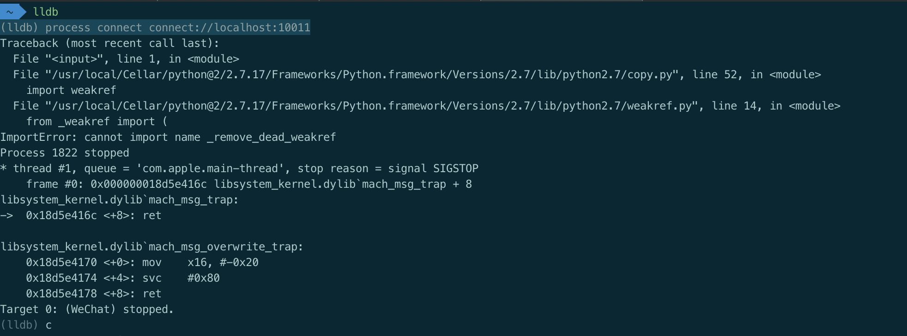
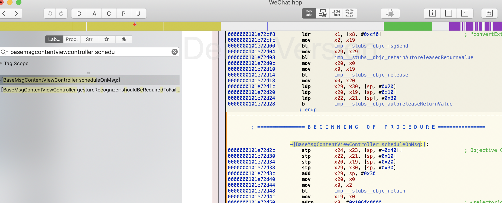

## ASLR

### 什么是ASLR

+ Address Space Layout Randomization，地址空间布局随机化
+ 是一种针对缓冲区溢出的安全保护技术，通过对堆、栈、共享库映射等线性区布局的随机化，通过增加攻击者预测目的地址的难度，防止攻击者直接定位攻击代码位置，达到阻止溢出攻击的目的的一种技术
+ iOS4.3开始引入了ASLR技术

### 如何调试别人的app

1. 我们可以通过`breakpoint set -a 地址`来调试别人app中的函数

2. 核心问题在于我们如何得到内存中方法真正的地址。

   ```
   函数未使用ASLR时内存地址 = __PAGEZERO的大小 + 该函数在Mach-O文件中的偏移
   函数真正的地址 =  函数使用ASLR后的__PAGEZERO偏移地址 + 函数未使用ASLR时内存地址
   函数真正的地址 = 函数使用ASLR后的__PAGEZERO偏移地址 + __PAGEZERO的大小 + 该函数在Mach-O文件中的偏移
   ```

3. 用hopper分析别人的对应架构的二进制文件，可以查看到对应函数未使用ASLR时的内存地址
4. 通过 `image list -f -o`查看ASLR偏移，即可计算得到真正的内存地址

### 直接用函数名无法打断点

1. 准备调试环境,mac通过usb连接手机 。debugserver连接到微信，lldb连接带debugserver。

   ```
   root# debugserver *:10011 -a WeChat
   
   (lldb) process connect connect://localhost:10011
   ```

   

   

2. 利用hopper分析WeChat的函数，随便找到一个函数，后面用来尝试打断点

   

3. 利用breakpoint来打断点，如下图，打断点失败。

   

   - 我们在hopper中看到的` scheduleOnMsg的地址`缺少ASLR的偏移地址,所以不能直接用`scheduleOnMsg的地址`来打断点
