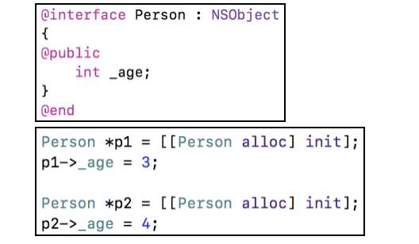
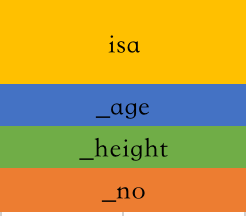
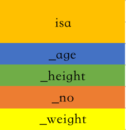
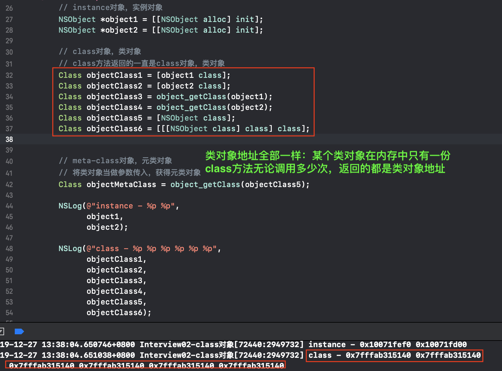
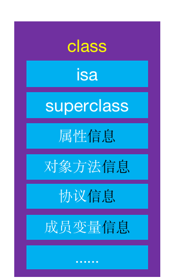
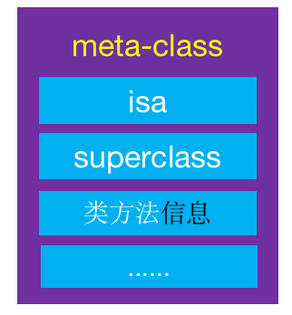
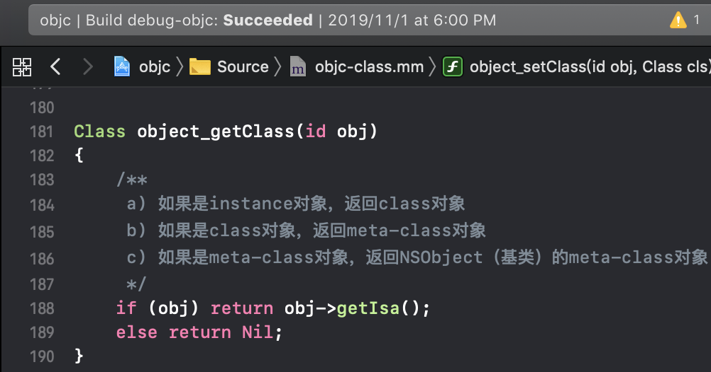
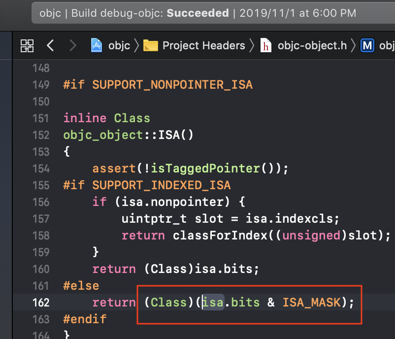

## OC对象的分类


+ Objective-C中的对象，简称OC对象，主要可以分为3种
  - instance对象（实例对象）
  - class对象（类对象）
  - meta-class对象（元类对象） 

### instance对象

+ instance对象就是通过类alloc出来的对象，每次调用alloc都会产生新的instance对象

  ```objective-c
  NSObject *object1 = [[NSObject alloc] init]
  NSObject *object2 = [[NSObject alloc] init]
  ```

  - object1、object2是NSObject的instance对象（实例对象）
  - 它们是不同的两个对象，分别占据着两块不同的内存

+ instance对象在内存中存储的信息包括

  - isa指针: 存放类的地址
  - 其他成员变量

+ instance对象简单内存示意图

  

  


+ 编译后，若NSObject, Person, Student 的底层结构如下

  ```objective-c
  struct NSObject_IMPL {
      Class isa;
  };
  
  struct MJPerson_IMPL {
      struct NSObject_IMPL NSObject_IVARS;
      int _age;
      int _height;
      int _no;
  }; 
  struct MJStudent_IMPL
  {
      struct MJPerson_IMPL MJPerson_IVARS;
      int _weight;
  };
  ```

  - MJPerson_IMPL直接包含NSObject_IMPL结构体

    - 其结构体相当于

      ```objective-c
      struct MJPerson_IMPL {
          Class isa;
          int _age;
          int _height;
          int _no;
      }; 
      ```

    - 内存布局为

      

  - MJStudent_IMPL直接包含MJPerson_IMPL结构体

    - 其结构体相当于

      ```
      struct MJStudent_IMPL {
          Class isa;
          int _age;
          int _height;
          int _no;
          int _weight;
      };
      ```

    - 内存布局为

      

### class对象



+ objectClass1 ~ objectClass5都是NSObject的class对象（类对象）

+ 它们是同一个对象。每个类在内存中有且只有一个class对象

+ class对象在内存中存储的信息主要包括

  - isa指针: 存放meta-class的地址
  - superclass指针:存放父类的地址
  - 类的属性信息（@property）、类的对象方法信息（instance method）
  - 类的协议信息（protocol）、类的成员变量信息（ivar）

  

### meta-class对象


+ objectMetaClass是NSObject的meta-class对象（元类对象）

+ 每个类在内存中有且只有一个meta-class对象

+ meta-class对象和class对象的内存结构是一样的，但是用途不一样，在内存中存储的信息主要包括

  - isa指针: 存放NSObject的meta-class的地址

  - superclass指针: 存放着meta-class的父类的值

  - 类的类方法信息（class method）

    

### object_getClass源码





- 通过isa指针来返回地址

- 64位后，isa和ISA_MASK做位运算之后，得到真正的class或meta-class的地址

  ```objective-c
  # if __arm64__
  #   define ISA_MASK        0x0000000ffffffff8ULL
  # elif __x86_64__
  #   define ISA             0x00007ffffffffff8ULL
  # endif
  ```

  

### objc_getClass源码


+ 传入类名, 通过look_up_class来查找类

### 小结

+ Class objc_getClass(const char *aClassName)

  - 传入字符串类名
  - 返回对应的类对象

+ Class object_getClass(id obj)

  1. 传入的obj可能是instance对象、class对象、meta-class对象
  2.  返回值
     - 如果是instance对象，返回class对象
     - 如果是class对象，返回meta-class对象
     - 如果是meta-class对象，返回NSObject（基类）的meta-class对象

+ -(Class)class、+(Class)class

  - 返回的就是类对象

    ```
     - (Class) {
       return self->isa;
     }
     
     + (Class) {
       return self;
     }
    ```

    

  