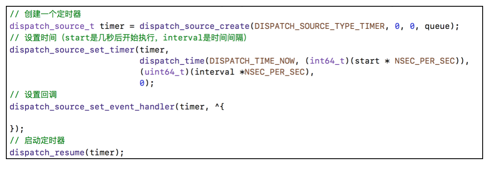
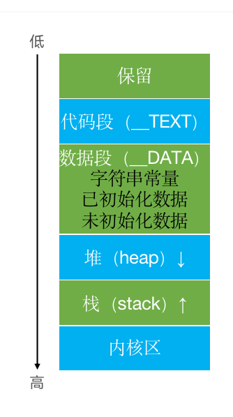

## 内存管理

### CADisplayLink、NSTimer使用问题

+ CADisplayLink、NSTimer会对target产生强引用，如果target又对它们产生强引用，那么就会引发循环引用

  ```objc
  @interface ViewController ()
  @property (strong, nonatomic) CADisplayLink *link;
  @property (strong, nonatomic) NSTimer *timer;
  @end
  
  @implementation ViewController
  
  - (void)viewDidLoad {
      [super viewDidLoad];
      
      // 保证调用频率和屏幕的刷帧频率一致，60FPS
      self.link = [CADisplayLink displayLinkWithTarget:[MJProxy proxyWithTarget:self] selector:@selector(linkTest)];
      //要加到runloop中
      [self.link addToRunLoop:[NSRunLoop mainRunLoop] forMode:NSDefaultRunLoopMode];
      
      self.timer = [NSTimer scheduledTimerWithTimeInterval:1.0 target:[MJProxy proxyWithTarget:self] selector:@selector(timerTest) userInfo:nil repeats:YES];
      
  //    __weak typeof(self) weakSelf = self;
  //    self.timer = [NSTimer scheduledTimerWithTimeInterval:1.0 repeats:YES block:^(NSTimer * _Nonnull timer) {
  //        [weakSelf timerTest];
  //    }];
  }
  
  - (void)timerTest
  {
      NSLog(@"%s", __func__);
  }
  
  - (void)linkTest
  {
      NSLog(@"%s", __func__);
  }
  
  - (void)dealloc
  {
      NSLog(@"%s", __func__);
      [self.link invalidate];
      [self.timer invalidate];
  }
  
  @end
  
  ```

### 解决方案

- 使用block

  

- 使用代理对象（Proxy)

  - 继承于NSObject的代理对象:需走消息转发机制

    ```objc
    @interface MJProxy : NSObject
    + (instancetype)proxyWithTarget:(id)target;
    @property (weak, nonatomic) id target;
    @end
    
    @implementation MJProxy
    + (instancetype)proxyWithTarget:(id)target
    {
        MJProxy *proxy = [[MJProxy alloc] init];
        proxy.target = target;
        return proxy;
    }
    
    - (id)forwardingTargetForSelector:(SEL)aSelector
    {
        return self.target;
    }
    @end
    ```

  - 继承于NSProxy的代理对象:不需走消息转发机制,专门用来做代理

    ```objc
    @interface MJProxy : NSProxy
    + (instancetype)proxyWithTarget:(id)target;
    @property (weak, nonatomic) id target;
    @end
    import "MJProxy.h"
    @implementation MJProxy
    + (instancetype)proxyWithTarget:(id)target
    {
        //NSProxy对象不需要调用init，因为它本来就没有init方法
        MJProxy *proxy = [MJProxy alloc];
        proxy.target = target;
        return proxy;
    }
    - (NSMethodSignature *)methodSignatureForSelector:(SEL)sel
    {
        return [self.target methodSignatureForSelector:sel];
    }
    
    - (void)forwardInvocation:(NSInvocation *)invocation
    {
        [invocation invokeWithTarget:self.target]
    }
    @end
    ```

  - 使用示例

    ```objc
    @interface ViewController ()
    @property (strong, nonatomic) NSTimer *timer;
    @end
    
    @implementation ViewController
    
    - (void)viewDidLoad {
        [super viewDidLoad];
        
        self.timer = [NSTimer scheduledTimerWithTimeInterval:1.0 target:[MJProxy proxyWithTarget:self] selector:@selector(timerTest) userInfo:nil repeats:YES];
    }
    - (void)timerTest
    {
        NSLog(@"%s", __func__);
    }
    - (void)dealloc
    {
        NSLog(@"%s", __func__);
        [self.timer invalidate];
    }
    @end
    
    ```

### GCD定时器

+ NSTimer依赖于RunLoop，如果RunLoop的任务过于繁重，可能会导致NSTimer不准时

  ```
  NSTimer是加到runloop中执行的吗，因为runloop跑一圈的时间是不定的。
  ```

  

+ 而GCD的定时器会更加准时， GCD定时器和系统内核挂钩，不受runloop影响

  

+ 代码测试

  ```objc
  - (void)test
  {
      // 队列
      // dispatch_queue_t queue = dispatch_get_main_queue();
      dispatch_queue_t queue = dispatch_queue_create("timer", DISPATCH_QUEUE_SERIAL);
      
      // 创建定时器
      dispatch_source_t timer = dispatch_source_create(DISPATCH_SOURCE_TYPE_TIMER, 0, 0, queue);
      
      // 设置时间
      uint64_t start = 2.0; // 2秒后开始执行
      uint64_t interval = 1.0; // 每隔1秒执行
      dispatch_source_set_timer(timer,
                                dispatch_time(DISPATCH_TIME_NOW, start * NSEC_PER_SEC),
                                interval * NSEC_PER_SEC, 0);
      
      // 设置回调
      //    dispatch_source_set_event_handler(timer, ^{
      //        NSLog(@"1111");
      //    });
      dispatch_source_set_event_handler_f(timer, timerFire);
      
      // 启动定时器
      dispatch_resume(timer);
      self.timer = timer;
  }
  
   //在子线程执行
  void timerFire(void *param)
  {  
      NSLog(@"2222 - %@", [NSThread currentThread]);
  }
  
  ```

+ GCD定时器封装

  ```objc
  //MJTimer.h
  @interface MJTimer : NSObject
  
  + (NSString *)execTask:(void(^)(void))task
             start:(NSTimeInterval)start
          interval:(NSTimeInterval)interval
           repeats:(BOOL)repeats
             async:(BOOL)async;
  
  + (NSString *)execTask:(id)target
                selector:(SEL)selector
                   start:(NSTimeInterval)start
                interval:(NSTimeInterval)interval
                 repeats:(BOOL)repeats
                   async:(BOOL)async;
  
  + (void)cancelTask:(NSString *)name;
  
  @end
  
    
  //MJTimer.m
  #import "MJTimer.h"
  @implementation MJTimer
  //存放所有的定时器
  static NSMutableDictionary *timers_;
  //保证操作timers_是线程安全的
  dispatch_semaphore_t semaphore_;
  + (void)initialize
  {
      static dispatch_once_t onceToken;
      dispatch_once(&onceToken, ^{
          timers_ = [NSMutableDictionary dictionary];
          semaphore_ = dispatch_semaphore_create(1);
      });
  }
  
  + (NSString *)execTask:(void (^)(void))task start:(NSTimeInterval)start interval:(NSTimeInterval)interval repeats:(BOOL)repeats async:(BOOL)async
  {
      if (!task || start < 0 || (interval <= 0 && repeats)) return nil;
      
      // 队列
      dispatch_queue_t queue = async ? dispatch_get_global_queue(0, 0) : dispatch_get_main_queue();
      
      // 创建定时器
      dispatch_source_t timer = dispatch_source_create(DISPATCH_SOURCE_TYPE_TIMER, 0, 0, queue);
      
      // 设置时间
      dispatch_source_set_timer(timer,
                                dispatch_time(DISPATCH_TIME_NOW, start * NSEC_PER_SEC),
                                interval * NSEC_PER_SEC, 0);
      
      
      //操作timers_时保证线程安全
      dispatch_semaphore_wait(semaphore_, DISPATCH_TIME_FOREVER);
      // 定时器的唯一标识
      NSString *name = [NSString stringWithFormat:@"%zd", timers_.count];
      // 存放到字典中
      timers_[name] = timer;
      dispatch_semaphore_signal(semaphore_);
      
      // 设置回调
      dispatch_source_set_event_handler(timer, ^{
          task();
          
          if (!repeats) { // 不重复的任务
              [self cancelTask:name];
          }
      });
      
      // 启动定时器
      dispatch_resume(timer);
      
      return name;
  }
  
  + (NSString *)execTask:(id)target selector:(SEL)selector start:(NSTimeInterval)start interval:(NSTimeInterval)interval repeats:(BOOL)repeats async:(BOOL)async
  {
      if (!target || !selector) return nil;
      
      return [self execTask:^{
          if ([target respondsToSelector:selector]) {
  #pragma clang diagnostic push
  #pragma clang diagnostic ignored "-Warc-performSelector-leaks"
              [target performSelector:selector];
  #pragma clang diagnostic pop
          }
      } start:start interval:interval repeats:repeats async:async];
  }
  
  + (void)cancelTask:(NSString *)name
  {
      if (name.length == 0) return;
      
      //操作timers_时保证线程安全
      dispatch_semaphore_wait(semaphore_, DISPATCH_TIME_FOREVER);
      
      dispatch_source_t timer = timers_[name];
      if (timer) {
          dispatch_source_cancel(timer);
          [timers_ removeObjectForKey:name];
      }
  
      dispatch_semaphore_signal(semaphore_);
  }
  
  @end
  ```

### 内存布局



+ 代码段：编译之后的代码
+ 数据段
  - 字符串常量：比如NSString *str = @"123"
  - 已初始化数据：已初始化的全局变量、静态变量等
  - 未初始化数据：未初始化的全局变量、静态变量等
+ 栈：函数调用开销，比如局部变量。分配的内存空间地址越来越小
+ 堆：通过alloc、malloc、calloc等动态分配的空间，分配的内存空间地址越来越大

### Tagged Pointer

+ 从64bit开始，iOS引入了Tagged Pointer技术，用于优化NSNumber、NSDate、NSString等小对象的存储
+ 在没有使用Tagged Pointer之前， NSNumber等对象需要动态分配内存、维护引用计数等，NSNumber指针存储的是堆中NSNumber对象的地址值
+ 使用Tagged Pointer之后，NSNumber指针里面存储的数据变成了：Tag + Data，也就是将数据直接存储在了指针中
+ 当指针不够存储数据时，才会使用动态分配内存的方式来存储数据
+ objc_msgSend能识别Tagged Pointer，比如NSNumber的intValue方法，直接从指针提取数据，节省了以前的调用开销
+ 如何判断一个指针是否为Tagged Pointer？
  - iOS平台，最高有效位是1（第64bit）
  - Mac平台，最低有效位是1


201-内存管理09-内存布局.vep

202-内存管理10-Tagged%20Pointer01.vep

203-内存管理11-Tagged%20Pointer02.vep

204-内存管理12-Tagged%20Pointer03.vep


day25

205-内存管理13-Tagged%20Pointer04.vep

206-内存管理14-MRC01.vep

207-内存管理15-MRC02.vep

208-内存管理16-MRC03.vep

209-内存管理17.vep

210-内存管理18-MRC05

211-内存管理19-copy01.vep

212-内存管理20-copy02


day26

213-内存管理21-copy03.vep

214-内存管理22-copy04.vep

215-内存管理23-copy05

216-内存管理24-copy06

217-内存管理25-引用计数的存储

218-内存管理26-weak指针的原理

219-内存管理27-autorelease原理01

220-内存管理28-autorelease原理02


day27

221-内存管理29-autorelease原理03.vep

222-内存管理30-autorelease原理04.vep

223-内存管理31-autorelease原理05.vep

224-内存管理32-RunLoop与autorelease01.vep

225-内存管理33-RunLoop与autorelease02.vep