## 多线程

### ios常见的多线程方案


### GCD的常用函数

+ GCD中有2个用来执行任务的函数

  - 用同步的方式执行任务

    ```c
    dispatch_sync(dispatch_queue_t queue, dispatch_block_t block);
    
    queue：队列
    block：任务
    ```

  - 用异步的方式执行任务

    ```c
    dispatch_async(dispatch_queue_t queue, dispatch_block_t block);
    ```

+ GCD源码：https://github.com/apple/swift-corelibs-libdispatch


### GCD的队列

+ GCD的队列可以分为2大类型
  - 并发队列（Concurrent Dispatch Queue）
    * 可以让多个任务并发（同时）执行（自动开启多个线程同时执行任务）
    * 并发功能只有在异步（dispatch_async）函数下才有效。因为只有异步函数才能开启新线程
  - 串行队列（Serial Dispatch Queue）
    - 让任务一个接着一个地执行（一个任务执行完毕后，再执行下一个任务）

### 同步，异步，并发，串行

+ 同步和异步主要影响: 能不能开启新的线程
  - 同步：在当前线程中执行任务，不具备开启新线程的能力
  - 异步：在新的线程中执行任务，具备开启新线程的能力
+ 并发和串行主要影响：任务的执行方式
  - 并发：多个任务并发（同时）执行
  - 串行：一个任务执行完毕后，再执行下一个任务

+ 各种队列的执行效果

  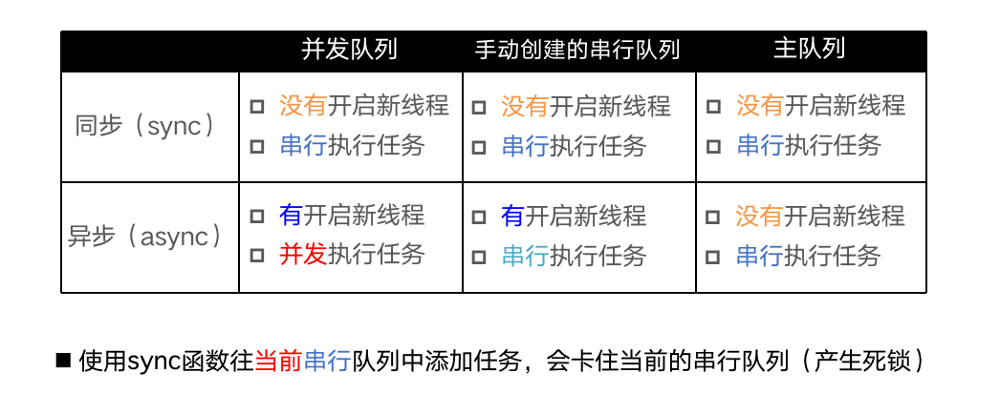

+ 线程同步的本质是不让多条线程同时占用同一块资源

### 使用sync死锁的情况

+ 在主线程执行sync,产生死锁

  ```objc
  - (void)viewDidLoad {
     [super viewDidLoad];
     NSLog(@"viewDidLoad111");
     dispatch_queue_t queue = dispatch_get_main_queue();
       dispatch_sync(queue, ^{
        NSLog(@"同步任务222");
     });
     NSLog(@"viewDidLoad333");
  }
  ```

  

  - 主线程和主队列任务，简化成上图
  - 当前在主线程执行ViewDidLoad任务时，向主队列中中加入一个sync任务
  - 串行队列先进先出，所以将sync任务加入到viewDidLoad任务之后，当viewDidLoad任务执行完之后，viewDidLoad任务出队,然后才会执行sync任务
  - 但是sync任务是要求立即执行的，也就是相当于:
    - 要执行完viewDidLoad任务时，需要先执行完sync任务
    - 而要执行sync任务的前提是viewDidLoad任务要执行完
  - 因此，资源相互争抢，导致死锁。

+ 在主线程执行async,不会产生死锁

  ```objc
  - (void)viewDidLoad {
     [super viewDidLoad];
     NSLog(@"viewDidLoad111");
     dispatch_queue_t queue = dispatch_get_main_queue();
       dispatch_async(queue, ^{
        NSLog(@"异步任务222");
     });
     NSLog(@"viewDidLoad333");
  }
  
  //打印结果
  viewDidLoad111
  viewDidLoad333
  异步任务222
  ```

  - 由上面的分析可知，主线程先执行完viewDidLoad任务
  - 然后viewDidLoad任务从主队列出队，然后开始执行async任务

+ 在手动创建的串行队列中，在其异步任务之内，再开启同步任务，会产生死锁

  ```objc
  - (void)interview03
  {
      NSLog(@"111111");
      dispatch_queue_t queue = dispatch_queue_create("queue0", DISPATCH_QUEUE_SERIAL);
      dispatch_async(queue, ^{ // 任务block0
          NSLog(@"222222");
          dispatch_sync(queue, ^{ // 任务block1
              NSLog(@"同步任务33333");
          });
      
          NSLog(@"444444");
      });
      
      NSLog(@"555555");
  }
  ```

  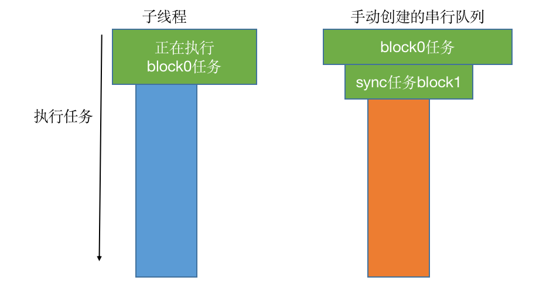

  + dispatch_async开启了一个子线程
  + 当前在子线程执行block0任务时，向串行队列中`queue0`加入一个sync任务block1
  + 串行队列先进先出，所以将sync任务block1加入到block0任务之后，当block0任务执行完之后，block0任务出队,然后才会执行block1
  + 但是sync任务block1是要求立即执行的，也就是相当于:
    - 要执行完block0任务时，需要先执行完sync任务block1
    - 而要执行sync任务block1的前提是block0任务要执行完
  + 因此，资源相互争抢，导致死锁。

+ 在手动创建的串行队列queue0中，在其异步任务之内，再开启同步任务queue1，不会产生死锁

  ```
  - (void)interview04
  {
      NSLog(@"111111");
      dispatch_queue_t queue0 = dispatch_queue_create("queue0", DISPATCH_QUEUE_SERIAL);
      dispatch_queue_t queue1 = dispatch_queue_create("queue1", DISPATCH_QUEUE_SERIAL);
      dispatch_async(queue0, ^{ // block0
          NSLog(@"222222 %@", [NSThread currentThread]);
          dispatch_sync(queue1, ^{ // block1
             NSLog(@"333333 %@", [NSThread currentThread]);
          });
          NSLog(@"444444 %@", [NSThread currentThread]);
      });
      NSLog(@"555555");
  }
  
  //打印结果
  111111
  555555
  222222  <NSThread: 0x600000392480>{number = 3, name = (null)}
  333333  <NSThread: 0x600000392480>{number = 3, name = (null)}
  444444  <NSThread: 0x600000392480>{number = 3, name = (null)}
  ```

  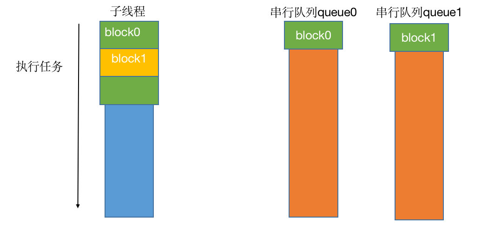

  - 执行block0任务，并在其内部执行block1。因为是sync创建的任务block1，所以block1和block0在同一个子线程
  - 因为block0和block1在不同的队列，所以不会产生死锁

+ 在并发队列中，在其异步任务内，开启同步任务，则不会产生死锁

  ````objc
  - (void)interview05
  {
      NSLog(@"111111");
      dispatch_queue_t queue = dispatch_queue_create("queue0", DISPATCH_QUEUE_CONCURRENT);
      dispatch_async(queue, ^{ // block0
          NSLog(@"222222 %@", [NSThread currentThread]);
          dispatch_sync(queue, ^{ // block1
              NSLog(@"333333 %@", [NSThread currentThread]);
          });
          NSLog(@"444444 %@", [NSThread currentThread]);
      });
      NSLog(@"555555");
  }
  
  //打印结果
  111111
  555555
  222222 <NSThread: 0x60000091de40>{number = 3, name = (null)}
  333333 <NSThread: 0x60000091de40>{number = 3, name = (null)}
  444444 <NSThread: 0x60000091de40>{number = 3, name = (null)}
  ````

  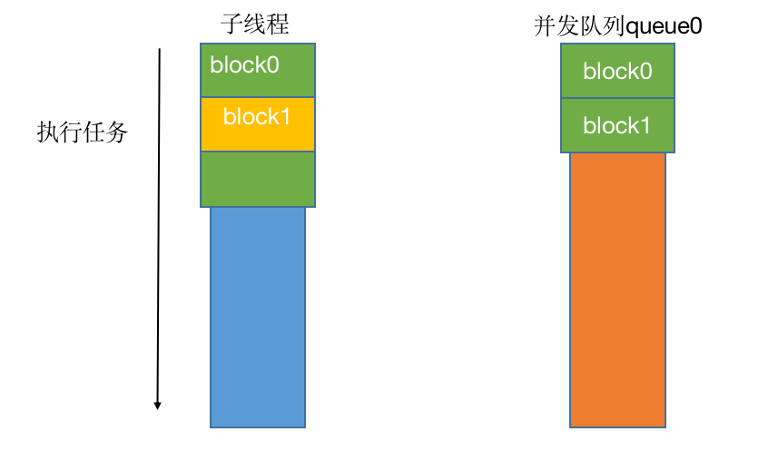

  + 并发队列的任务是并发执行的，并不是先进先出的,所以不会发生死锁

### GNUsetp

+ GNUstep是GNU计划的项目之一，它将Cocoa的OC库重新开源实现了一遍
+ 源码地址：http://www.gnustep.org/resources/downloads.php （`GNUstep Base`）
+ 虽然GNUstep不是苹果官方源码，但还是具有一定的参考价值

### performSelector

+ 不延时执行：本质上是objc_msgSend消息转发机制

  ```objc
  - (id)performSelector:(SEL)sel withObject:(id)obj1 withObject:(id)obj2 {
      if (!sel) [self doesNotRecognizeSelector:sel];
      return ((id(*)(id, SEL, id, id))objc_msgSend)(self, sel, obj1, obj2);
  }
  
  + (id)performSelector:(SEL)sel withObject:(id)obj1 withObject:(id)obj2 {
      if (!sel) [self doesNotRecognizeSelector:sel];
      return ((id(*)(id, SEL, id, id))objc_msgSend)((id)self, sel, obj1, obj2);
  }
  ```

+ 延时执行: 在GNUsetp Base-> NSRunloop.m中，可以看到是放在runloop中通过定时器执行,因此放在子线程中执行时，要开启子线程的runloop。

  ```objc
  - (void) performSelector: (SEL)aSelector
  	      withObject: (id)argument
  	      afterDelay: (NSTimeInterval)seconds
  {
    NSRunLoop		*loop = [NSRunLoop currentRunLoop];
    GSTimedPerformer	*item;
  
    item = [[GSTimedPerformer alloc] initWithSelector: aSelector
  					     target: self
  					   argument: argument
  					      delay: seconds];
    [[loop _timedPerformers] addObject: item];
    RELEASE(item);
    [loop addTimer: item->timer forMode: NSDefaultRunLoopMode];
  }
  ```

### GCD队列组的使用

+ 如何用gcd实现以下功能?

  - 异步并发执行任务1、任务2

  - 等任务1、任务2都执行完毕后，再回到主线程执行任务3, 任务4

    ```objc
    
        dispatch_group_t group = dispatch_group_create();
        // 创建并发队列
        dispatch_queue_t queue = dispatch_queue_create("my_queue", DISPATCH_QUEUE_CONCURRENT);
        
        // 添加异步任务
        dispatch_group_async(group, queue, ^{
            for (int i = 0; i < 5; i++) {
                NSLog(@"任务1-%@", [NSThread currentThread]);
            }
        });
        
        dispatch_group_async(group, queue, ^{
            for (int i = 0; i < 5; i++) {
                NSLog(@"任务2-%@", [NSThread currentThread]);
            }
        });
        
        dispatch_group_notify(group, dispatch_get_main_queue(), ^{
            for (int i = 0; i < 5; i++) {
                NSLog(@"任务3-%@", [NSThread currentThread]);
            }
        });
        
        dispatch_group_notify(group, dispatch_get_main_queue(), ^{
            for (int i = 0; i < 5; i++) {
                NSLog(@"任务4-%@", [NSThread currentThread]);
            }
        });
    
    //先并发打印:任务1， 任务2
    //然后再串行打印任务3
    //然后再串行打印任务4
    ```

### 多线程安全隐患分析

+ 资源共享
  - 1块资源可能会被多个线程共享，也就是多个线程可能会访问同一块资源
  - 比如多个线程访问同一个对象、同一个变量、同一个文件
+ 当多个线程访问同一块资源时，很容易引发数据错乱和数据安全问题


####  存钱取钱

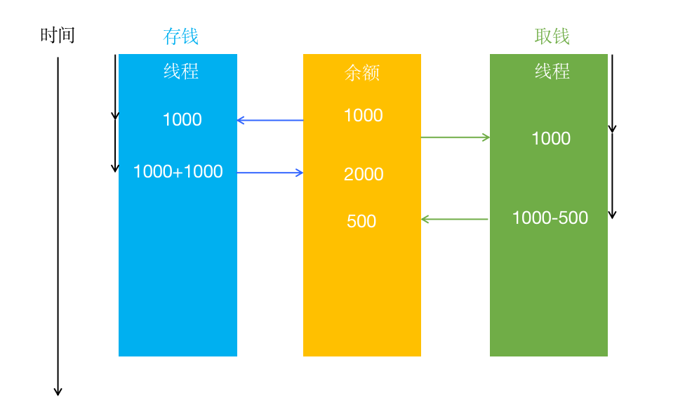

+ 存钱线程先读1000， 然后取钱线程读1000
+ 存钱线程存1000，将余额改为2000
+ 取钱线程取500，将余额改为500,造成结果错误

+  代码测试

  ```objc
  #import "ViewController.h"
  @interface ViewController ()
  @property (assign, nonatomic) int money;
  @end
  
  @implementation ViewController
  
  - (void)viewDidLoad {
      [super viewDidLoad];
      // Do any additional setup after loading the view, typically from a nib.
      [self moneyTest];
  }
  
  /**
   存钱、取钱演示
   */
  - (void)moneyTest
  {
      self.money = 100;
      dispatch_queue_t queue = dispatch_get_global_queue(0, 0);
      dispatch_async(queue, ^{
          for (int i = 0; i < 10; i++) {
              [self saveMoney];
          }
      });
      dispatch_async(queue, ^{
          for (int i = 0; i < 10; i++) {
              [self drawMoney];
          }
      });
  }
  /**
   存钱
   */
  - (void)saveMoney
  {
      int oldMoney = self.money;
      sleep(.2);
      oldMoney += 50;
      self.money = oldMoney;
      
      NSLog(@"存50，还剩%d元 - %@", oldMoney, [NSThread currentThread]);
  }
  
  /**
   取钱
   */
  - (void)drawMoney
  {
      int oldMoney = self.money;
      sleep(.2);
      oldMoney -= 20;
      self.money = oldMoney;
      
      NSLog(@"取20，还剩%d元 - %@", oldMoney, [NSThread currentThread]);
  }
  @end
    
  //正确余额应该是400，但实际结果一般都不是400.
  ```

#### 卖票

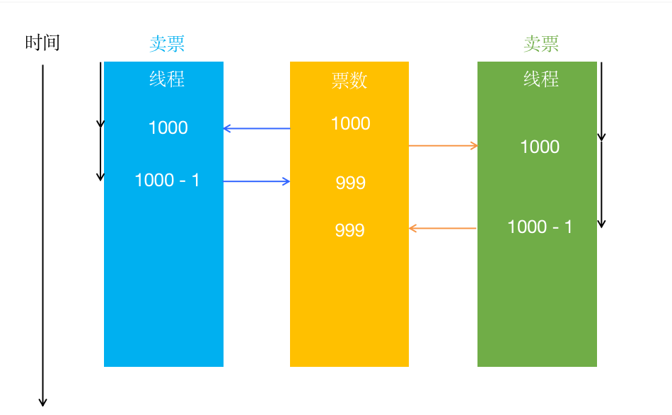

+ 卖票线程0先读1000， 卖票线程1读1000

+ 卖票线程0卖1，将票改为999

+ 卖票线程1卖1，也将票改为999，此时票数已经错误了

+ 代码测试

  ```objc
  #import "ViewController.h"
  @interface ViewController ()
  @property (assign, nonatomic) int ticketsCount;
  @end
  
  @implementation ViewController
  
  - (void)viewDidLoad {
      [super viewDidLoad];
      // Do any additional setup after loading the view, typically from a nib.
      [self ticketTest];
  }
  /**
   卖1张票
   */
  - (void)saleTicket
  {
      int oldTicketsCount = self.ticketsCount;
      sleep(.2);
      oldTicketsCount--;
      self.ticketsCount = oldTicketsCount;
      NSLog(@"还剩%d张票 - %@", oldTicketsCount, [NSThread currentThread]);
  }
  
  /**
   卖票演示
   */
  - (void)ticketTest
  {
      self.ticketsCount = 15;
      dispatch_queue_t queue = dispatch_get_global_queue(0, 0);
      dispatch_async(queue, ^{
          for (int i = 0; i < 5; i++) {
               [self saleTicket];
          }
      });
      dispatch_async(queue, ^{
          for (int i = 0; i < 5; i++) {
              [self saleTicket];
          }
      });
      dispatch_async(queue, ^{
          for (int i = 0; i < 5; i++) {
              [self saleTicket];
          }
      });
  }
  @end
  
  //正确余额应该是0，但实际结果一般都不是0.
  ```

### 多线程安全隐患的解决方案

+ 解决方案：使用线程同步技术（同步，就是协同步调，按预定的先后次序进行）
+ 常见的线程同步技术是：加锁

### ios中的线程同步方案

+ OSSpinLock
+ os_unfair_lock
+ pthread_mutex
+ dispatch_semaphore
+ dispatch_queue(DISPATCH_QUEUE_SERIAL)
+ NSLock
+ NSRecursiveLock
+ NSCondition
+ NSConditionLock
+ @synchronized

### OSSpinLock

+ OSSpinLock叫做”自旋锁”，等待锁的线程会处于忙等（busy-wait）状态，一直占用着CPU资源
  
- 忙等:相当于一直是一个while循环去尝试获取锁，占据了cpu资源
  
+ 目前已经不再安全，可能会出现优先级反转问题

  - 如果等待锁的线程优先级较高，它会一直占用着CPU资源，优先级低的线程就无法释放锁

  - 从iOS10被废弃，建议后面使用`os_unfair_lock`

  - 需要导入头文件#import <libkern/OSAtomic.h>

    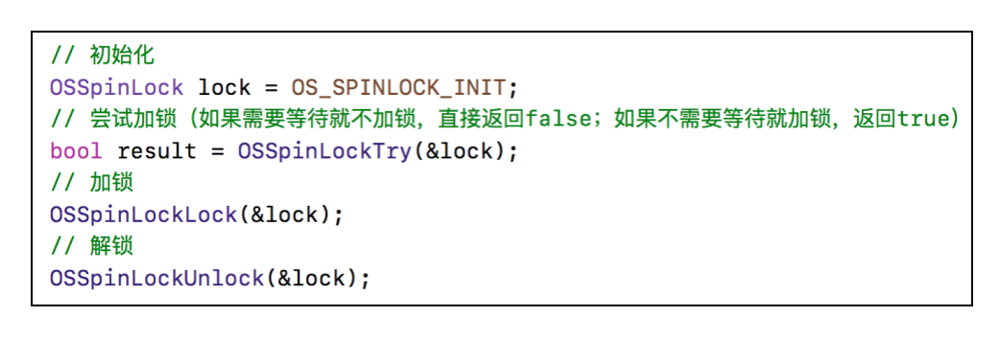

+ 优先级反转解释

   ```
  thread1: 优先级比较高
  thread2: 优先级比较低
  
  调度采用时间片轮转调度算法（进程，线程）
  
  1. 假如thread2优先级比较低，但先获取锁
  2. 那么这个时候thread1,处于忙等状态，一直while循环去获取锁
  3. thread1优先级又比较高，可能导致cpu时间被大量分配给它
  4. 因此导致thread2无法执行下去，从而无法释放锁
  ```

+ 测试自旋锁的使用

  1. 基本的测试代码

     ```objc
     @interface MJBaseDemo : NSObject
     - (void)moneyTest;
     - (void)ticketTest;
     #pragma mark - 暴露给子类去使用, 这些方法都需要加锁
     - (void)__saveMoney;
     - (void)__drawMoney;
     - (void)__saleTicket;
     @end
     interface MJBaseDemo()
     @property (assign, nonatomic) int money;
     @property (assign, nonatomic) int ticketsCount;
     @end
     
     @implementation MJBaseDemo
     
     /**
      存钱、取钱演示
      */
     - (void)moneyTest
     {
         self.money = 100;
         
         dispatch_queue_t queue = dispatch_get_global_queue(0, 0);
         
         dispatch_async(queue, ^{
             for (int i = 0; i < 10; i++) {
                 [self __saveMoney];
             }
         });
         
         dispatch_async(queue, ^{
             for (int i = 0; i < 10; i++) {
                 [self __drawMoney];
             }
         });
     }
     
     /**
      存钱
      */
     - (void)__saveMoney
     {
         int oldMoney = self.money;
         sleep(.2);
         oldMoney += 50;
         self.money = oldMoney;
         
         NSLog(@"存50，还剩%d元 - %@", oldMoney, [NSThread currentThread]);
     }
     
     /**
      取钱
      */
     - (void)__drawMoney
     {
         int oldMoney = self.money;
         sleep(.2);
         oldMoney -= 20;
         self.money = oldMoney;
         
         NSLog(@"取20，还剩%d元 - %@", oldMoney, [NSThread currentThread]);
     }
     
     /**
      卖1张票
      */
     - (void)__saleTicket
     {
         int oldTicketsCount = self.ticketsCount;
         sleep(.2);
         oldTicketsCount--;
         self.ticketsCount = oldTicketsCount;
         NSLog(@"还剩%d张票 - %@", oldTicketsCount, [NSThread currentThread]);
     }
     
     /**
      卖票演示
      */
     - (void)ticketTest
     {
         self.ticketsCount = 15;
         
         dispatch_queue_t queue = dispatch_get_global_queue(0, 0);
         
         dispatch_async(queue, ^{
             for (int i = 0; i < 5; i++) {
                 [self __saleTicket];
             }
         });
         dispatch_async(queue, ^{
             for (int i = 0; i < 5; i++) {
                 [self __saleTicket];
             }
         });
         
         dispatch_async(queue, ^{
             for (int i = 0; i < 5; i++) {
                 [self __saleTicket];
             }
         });
     }
     
     @end
     ```

  2. 使用自旋转进行加锁，解锁

     ```objc
     #import <libkern/OSAtomic.h>
     @interface OSSpinLockDemo : MJBaseDemo
       
     @end
     @interface OSSpinLockDemo()
     @property (assign, nonatomic) OSSpinLock moneyLock;
     @property (assign, nonatomic) OSSpinLock ticketLock;
     @end
     @implementation OSSpinLockDemo
     
     - (instancetype)init
     {
         if (self = [super init]) {
             //初始化锁
             self.moneyLock = OS_SPINLOCK_INIT;
             self.ticketLock = OS_SPINLOCK_INIT;
         }
         return self;
     }
     
     - (void)__drawMoney
     {
         //加锁
         OSSpinLockLock(&_moneyLock);
         
         [super __drawMoney];
         //解锁
         OSSpinLockUnlock(&_moneyLock);
     }
     
     - (void)__saveMoney
     {
         //加锁
         OSSpinLockLock(&_moneyLock);
         
         [super __saveMoney];
         //解锁
         OSSpinLockUnlock(&_moneyLock);
     }
     
     - (void)__saleTicket
     {
         //加锁
         OSSpinLockLock(&_ticketLock);
         [super __saleTicket];
         //解锁
         OSSpinLockUnlock(&_ticketLock);
     }
     @end
     ```

     

### os_unfair_lock

+ os_unfair_lock用于取代不安全的OSSpinLock ，从iOS10开始才支持

+ 从底层调用看，等待os_unfair_lock锁的线程会处于休眠状态，并非忙等

+ 低级锁的特点就是等待锁的时候让线程进行休眠

  ```
  Low-level lock that allows waiters to block efficiently on contention
  ```

+ 需要导入头文件`#import <os/lock.h>`

  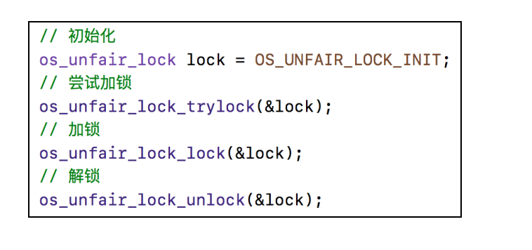

+ 使用os_unfair_lock进行加锁，解锁

  ```objc
  @interface OSUnfairLockDemo()
  // Low-level lock的特点等不到锁就休眠
  @property (assign, nonatomic) os_unfair_lock moneyLock;
  @property (assign, nonatomic) os_unfair_lock ticketLock;
  @end
  
  @implementation OSUnfairLockDemo
  
  - (instancetype)init
  {
      if (self = [super init]) {
          self.moneyLock = OS_UNFAIR_LOCK_INIT;
          self.ticketLock = OS_UNFAIR_LOCK_INIT;
      }
      return self;
  }
  
  - (void)__saleTicket
  {
      os_unfair_lock_lock(&_ticketLock);
      
      [super __saleTicket];
      
      os_unfair_lock_unlock(&_ticketLock);
  }
  
  - (void)__saveMoney
  {
      os_unfair_lock_lock(&_moneyLock);
      
      [super __saveMoney];
      
      os_unfair_lock_unlock(&_moneyLock);
  }
  
  - (void)__drawMoney
  {
      os_unfair_lock_lock(&_moneyLock);
      
      [super __drawMoney];
      
      os_unfair_lock_unlock(&_moneyLock);
  }
  
  @end
  
  ```

### pthread_mutex-普通锁

+ mutex叫做”互斥锁”，等待锁的线程会处于休眠状态

+ 需要导入头文件`#import <pthread.h>`

  

+ 测试pthread_mutex普通锁

  ```objc
  @interface MutexDemo()
  @property (assign, nonatomic) pthread_mutex_t ticketMutex;
  @property (assign, nonatomic) pthread_mutex_t moneyMutex;
  @end
  
  @implementation MutexDemo
  
  - (void)__initMutex:(pthread_mutex_t *)mutex
  {
      // 静态初始化
      // pthread_mutex_t mutex = PTHREAD_MUTEX_INITIALIZER;
  //    // 初始化属性
  //    pthread_mutexattr_t attr;
  //    pthread_mutexattr_init(&attr);
  //    pthread_mutexattr_settype(&attr, PTHREAD_MUTEX_DEFAULT);
  //    // 初始化锁
  //    pthread_mutex_init(mutex, &attr);
  //    // 销毁属性
  //    pthread_mutexattr_destroy(&attr);
      
      // 初始化属性
  //    pthread_mutexattr_t attr;
  //    pthread_mutexattr_init(&attr);
  //    pthread_mutexattr_settype(&attr, PTHREAD_MUTEX_DEFAULT);
      // 初始化锁
      pthread_mutex_init(mutex, NULL);
      // 销毁属性
  //    pthread_mutexattr_destroy(&attr);
  }
  
  - (instancetype)init
  {
      if (self = [super init]) {
          [self __initMutex:&_ticketMutex];
          [self __initMutex:&_moneyMutex];
      }
      return self;
  }
  
  // 死锁：永远拿不到锁
  - (void)__saleTicket
  {
      pthread_mutex_lock(&_ticketMutex);
      
      [super __saleTicket];
      
      pthread_mutex_unlock(&_ticketMutex);
  }
  
  - (void)__saveMoney
  {
      pthread_mutex_lock(&_moneyMutex);
      
      [super __saveMoney];
      
      pthread_mutex_unlock(&_moneyMutex);
  }
  
  - (void)__drawMoney
  {
      pthread_mutex_lock(&_moneyMutex);
      
      [super __drawMoney];
      
      pthread_mutex_unlock(&_moneyMutex);
  }
  
  - (void)dealloc
  {
      pthread_mutex_destroy(&_moneyMutex);
      pthread_mutex_destroy(&_ticketMutex);
  }
  
  @end
  ```

### pthread_mutex-递归锁

+ 可以做递归锁：允许**同一个线程**对一把锁进行重复加锁

  

+ 测试递归锁

  ```objc
  #import <pthread.h>
  @interface MutexDemo2()
  @property (assign, nonatomic) pthread_mutex_t mutex;
  @end
  
  @implementation MutexDemo2
  
  - (void)__initMutex:(pthread_mutex_t *)mutex
  {
      // 递归锁：允许同一个线程对一把锁进行重复加锁
      
      // 初始化属性
      pthread_mutexattr_t attr;
      pthread_mutexattr_init(&attr);
      pthread_mutexattr_settype(&attr, PTHREAD_MUTEX_RECURSIVE);
      // 初始化锁
      pthread_mutex_init(mutex, &attr);
      // 销毁属性
      pthread_mutexattr_destroy(&attr);
  }
  
  - (instancetype)init
  {
      if (self = [super init]) {
          [self __initMutex:&_mutex];
      }
      return self;
  }
  - (void)otherTest
  {   //_mutex此时为递归锁
      //如果_mutex为普通锁，那么递归调用会死锁的
      pthread_mutex_lock(&_mutex);
      NSLog(@"%s", __func__);
      static int count = 0;
      if (count < 10) {
          count++;
          [self otherTest];
      }
      pthread_mutex_unlock(&_mutex);
  }
  - (void)dealloc
  {
      pthread_mutex_destroy(&_mutex);
  }
  @end
  ```

### pthread_mutex-条件锁

+ 常用于生产消费者模型，当不满足条件时，线程进行休眠。当满足一定的条件后，线程被唤醒

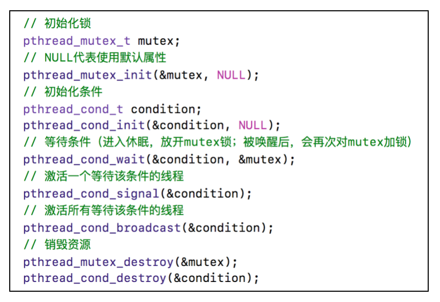

+ 条件锁代码

  ```objc
  #import <pthread.h>
  
  @interface MutexDemo3()
  @property (assign, nonatomic) pthread_mutex_t mutex;
  @property (assign, nonatomic) pthread_cond_t cond;
  @property (strong, nonatomic) NSMutableArray *data;
  @end
  
  @implementation MutexDemo3
  
  - (instancetype)init
  {
      if (self = [super init]) {
          // 初始化属性
  //        pthread_mutexattr_t attr;
  //        pthread_mutexattr_init(&attr);
  //        pthread_mutexattr_settype(&attr, PTHREAD_MUTEX_RECURSIVE);
          // 初始化锁
          pthread_mutex_init(&_mutex, NULL);
          // 销毁属性
  //        pthread_mutexattr_destroy(&attr);
          
          // 初始化条件
          pthread_cond_init(&_cond, NULL);
          self.data = [NSMutableArray array];
      }
      return self;
  }
  
  - (void)otherTest
  {
      //__remove线程
      [[[NSThread alloc] initWithTarget:self selector:@selector(__remove) object:nil] start];
      //__add线程
      [[[NSThread alloc] initWithTarget:self selector:@selector(__add) object:nil] start];
  }
  
  // 生产者-消费者模式
  // 线程1
  // 删除数组中的元素
  - (void)__remove
  {
     // __remove线程先执行
      pthread_mutex_lock(&_mutex);
      NSLog(@"__remove - begin");
      
      if (self.data.count == 0) {
          //1. 线程进入休眠，同时释放锁
          //2. 线程被唤醒后，开始尝试获取锁
          pthread_cond_wait(&_cond, &_mutex);
      }
      [self.data removeLastObject];
      NSLog(@"删除了元素");
      pthread_mutex_unlock(&_mutex);
  }
  
  // 线程2
  // 往数组中添加元素
  - (void)__add
  {
      //当__remove线程先执行,并休眠时，释放了锁，此时__add获取到锁
      pthread_mutex_lock(&_mutex);
      sleep(1);
      [self.data addObject:@"Test"];
      NSLog(@"添加了元素");
      //发送信号通知删除线程
      pthread_cond_signal(&_cond);
      // 广播信号
  //    pthread_cond_broadcast(&_cond);
      //释放锁
      pthread_mutex_unlock(&_mutex);
  }
  
  
  - (void)dealloc
  {
      pthread_mutex_destroy(&_mutex);
      pthread_cond_destroy(&_cond);
  }
  @end
  
  @implementation ViewController
  - (void)viewDidLoad {
      [super viewDidLoad];
      //调用
      MJBaseDemo *demo = [[MutexDemo3 alloc] init];
      [demo otherTest];
  }
  
  @end
  
  //打印结果
  __remove - begin  
  添加了元素
  删除了元素
  ```

  + `__remove`线程先获取到锁，`__add`线程获取不到锁进入休眠
  + `__remove`发现数组为0， 进入休眠，并释放锁，等待条件满足后被唤醒
  + `__add`线程获取到锁，然后添加元素后，发送信号通知这个条件已经满足
  + `__remove`线程接收到信号后，尝试获取锁。
  + 当`__add`线程释放掉锁后，`__remove`线程获取到锁，继续执行，最后再释放锁
  + 此时加锁和解锁也正好是成对的


### 自旋锁、互斥锁汇编分析

+ 自旋锁汇编分析

  ```objc
  - (void)__saleTicket
  {
      OSSpinLockLock(&_ticketLock);
      [super __saleTicket]; //sleep(10) 多睡一会儿便于测试
      OSSpinLockUnlock(&_ticketLock);
  }
  
  MJBaseDemo *demo = [[OSSpinLockDemo alloc] init];
  [demo ticketTest];
  
  ```

  

  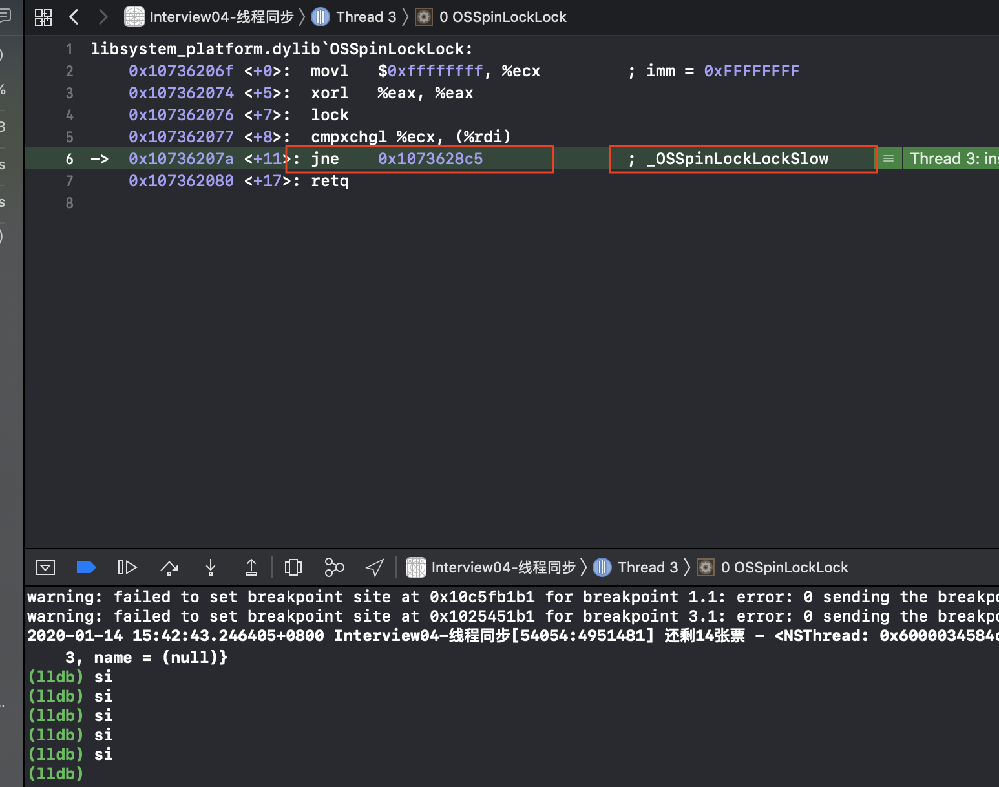

  

  

+ 互斥锁汇编分析

  ```objc
  - (void)__saleTicket
  {
      pthread_mutex_lock(&_ticketMutex);
      [super __saleTicket];
      pthread_mutex_unlock(&_ticketMutex);
  }
  
  
  - (void)viewDidLoad {
      [super viewDidLoad];
      MJBaseDemo *demo = [[MutexDemo alloc] init];
      [demo ticketTest];
  }
  
  @end
  
  ```

  

  

  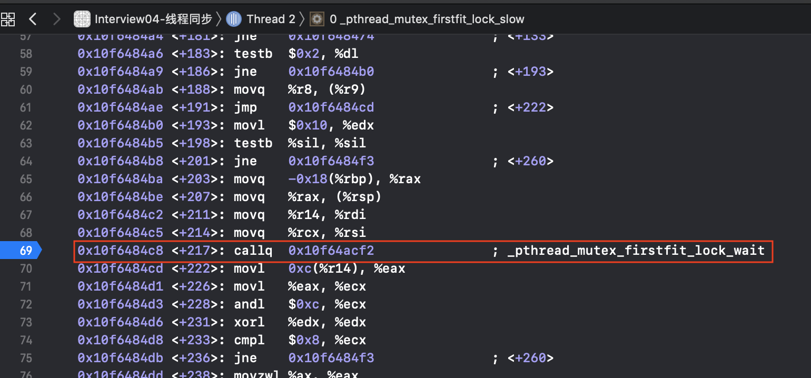

  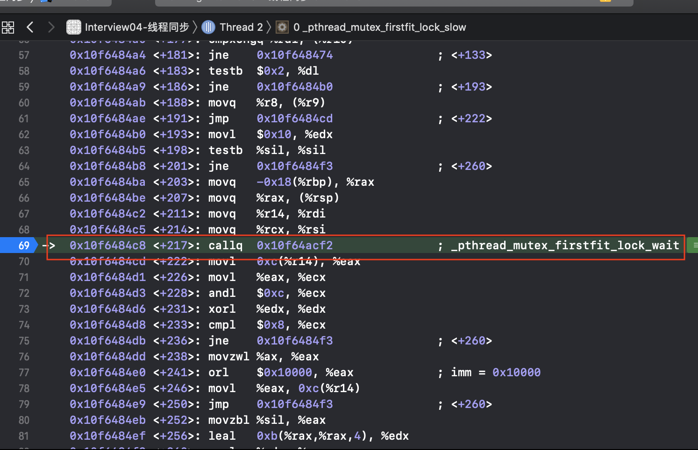

  

  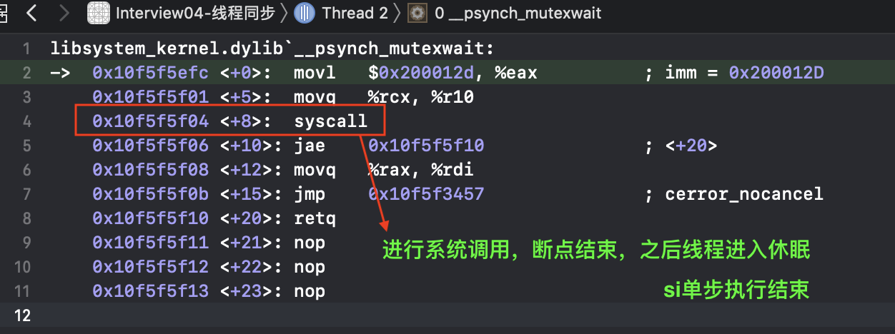


### NSLock, NSRecursiveLock

+ NSLock是对mutex普通锁的封装

  

  ```
  tryLock:不会阻塞线程,如果加不到锁返回NO,继续往后走
  lockBeforeDate:在limit之内加不到锁，则等待。时间到了之后还加不到锁，返回NO,继续往后走
  ```

  

    

+ NSRecursiveLock也是对mutex递归锁的封装，API跟NSLock基本一致

+ NSLock测试代码

  ```objc
  
  @interface NSLockDemo()
  @property (strong, nonatomic) NSLock *ticketLock;
  @property (strong, nonatomic) NSLock *moneyLock;
  @end
  
  @implementation NSLockDemo
  
  
  - (instancetype)init
  {
      if (self = [super init]) {
          self.ticketLock = [[NSLock alloc] init];
          self.moneyLock = [[NSLock alloc] init];
      }
      return self;
  }
  
  // 死锁：永远拿不到锁
  - (void)__saleTicket
  {
      [self.ticketLock lock];
      
      [super __saleTicket];
      
      [self.ticketLock unlock];
  }
  
  - (void)__saveMoney
  {
      [self.moneyLock lock];
      
      [super __saveMoney];
      
      [self.moneyLock unlock];
  }
  
  - (void)__drawMoney
  {
      [self.moneyLock lock];
      
      [super __drawMoney];
      
      [self.moneyLock unlock];
  }
  
  @end
  ```

  

### NSCondition

+ NSCondition是对mutex和cond的封装

  

+ NSCondition测试代码

  ```objc
  @interface NSConditionDemo()
  @property (strong, nonatomic) NSCondition *condition;
  @property (strong, nonatomic) NSMutableArray *data;
  @end
  @implementation NSConditionDemo
  
  - (instancetype)init
  {
      if (self = [super init]) {
          self.condition = [[NSCondition alloc] init];
          self.data = [NSMutableArray array];
      }
      return self;
  }
  
  - (void)otherTest
  {
      [[[NSThread alloc] initWithTarget:self selector:@selector(__remove) object:nil] start];
      
      [[[NSThread alloc] initWithTarget:self selector:@selector(__add) object:nil] start];
  }
  
  // 生产者-消费者模式
  // 线程1
  // 删除数组中的元素
  - (void)__remove
  {
      [self.condition lock];
      NSLog(@"__remove - begin");
      
      if (self.data.count == 0) {
          // 等待
          [self.condition wait];
      }
      
      [self.data removeLastObject];
      NSLog(@"删除了元素");
      
      [self.condition unlock];
  }
  
  // 线程2
  // 往数组中添加元素
  - (void)__add
  {
      [self.condition lock];
      
      sleep(1);
      
      [self.data addObject:@"Test"];
      NSLog(@"添加了元素");
      // 信号
      [self.condition signal];
      
      // 广播
  //    [self.condition broadcast];
      [self.condition unlock];
  }
  @end
  ```


### NSConditionLock

+ NSConditionLock是对NSCondition的进一步封装，可以设置具体的条件值

  

+ NSConditionLock测试代码

  ```objc
  #import "NSConditionLockDemo.h"
  @interface NSConditionLockDemo()
  @property (strong, nonatomic) NSConditionLock *conditionLock;
  @end
  
  @implementation NSConditionLockDemo
  
  - (instancetype)init
  {
      if (self = [super init]) {
          self.conditionLock = [[NSConditionLock alloc] initWithCondition:1];
      }
      return self;
  }
  
  - (void)otherTest
  {
      [[[NSThread alloc] initWithTarget:self selector:@selector(__one) object:nil] start];
      
      [[[NSThread alloc] initWithTarget:self selector:@selector(__two) object:nil] start];
      
      [[[NSThread alloc] initWithTarget:self selector:@selector(__three) object:nil] start];
  }
  
  - (void)__one
  {
      [self.conditionLock lock];
      NSLog(@"__one");
      sleep(1);
  
      [self.conditionLock unlockWithCondition:2];
  }
  
  - (void)__two
  {
      [self.conditionLock lockWhenCondition:2];
      
      NSLog(@"__two");
      sleep(1);
      
      [self.conditionLock unlockWithCondition:3];
  }
  
  - (void)__three
  {
      [self.conditionLock lockWhenCondition:3];
      
      NSLog(@"__three");
      
      [self.conditionLock unlock];
  }
  
  @end
  
  
  //打印结果
  __one
  __two
  __three
    
    
  1. 初始条件为1，那么只有__one线程能获得锁，打印"__one",__one线程释放锁时，将条件设为2
  2. 条件为2，__two线程能获得锁，打印"__two",__two线程释放锁时，将条件设为3
  3. 条件为3，__three线程能获得锁，打印"__three",__tree线程释放锁
  ```

### dispatch_queue

+ 直接使用GCD的串行队列，也是可以实现线程同步的

  

+ dispatch_queue测试代码

  ```objc
  /**
   存钱、取钱演示
   */
  - (void)moneyTest
  {
      self.money = 100;
      
      dispatch_queue_t queue = dispatch_get_global_queue(0, 0);
      
      dispatch_async(queue, ^{
          for (int i = 0; i < 10; i++) {
              [self __saveMoney];
          }
      });
      
      dispatch_async(queue, ^{
          for (int i = 0; i < 10; i++) {
              [self __drawMoney];
          }
      });
  }
  
  
  #import "SerialQueueDemo.h"
  @interface SerialQueueDemo()
  @property (strong, nonatomic) dispatch_queue_t ticketQueue;
  @property (strong, nonatomic) dispatch_queue_t moneyQueue;
  @end
  
  @implementation SerialQueueDemo
  
  - (instancetype)init
  {
      if (self = [super init]) {
          self.ticketQueue = dispatch_queue_create("ticketQueue", DISPATCH_QUEUE_SERIAL);
          self.moneyQueue = dispatch_queue_create("moneyQueue", DISPATCH_QUEUE_SERIAL);
      }
      return self;
  }
  
  - (void)__drawMoney
  {
      dispatch_sync(self.moneyQueue, ^{
          [super __drawMoney];
      });
  }
  - (void)__saveMoney
  {
      dispatch_sync(self.moneyQueue, ^{
          [super __saveMoney];
      });
  }
  
  - (void)__saleTicket
  {
      dispatch_sync(self.ticketQueue, ^{
          [super __saleTicket];
      });
  }
  @end
  ```

  + 将对资源的访问放到串行队列中，那么多个线程对这个资源进行访问时，只能串行执行

    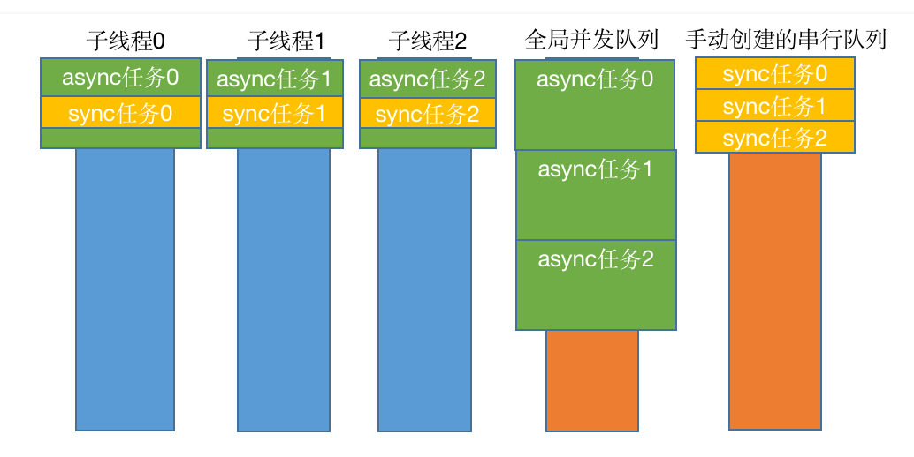

    ```
    1. 假设全局并发队列async开启3个线程执行任务，子线程的执行是无序的。分别为async任务0， async任务1，async任务2
    2. 在async任务0,  async任务1，async任务2中，在访问同一块资源时，分别开启sync任务0,sync任务1, sync任务2,并把所有的同步任务放到串行队列中
    3. 那么这子三个线程要访问资源时，肯定是串行的。只有一个同步任务结束后，下一个同步任务才会执行。
    ```


### dispatch_semaphore

+ semaphore叫做”信号量”

  - 信号量的初始值，可以用来控制线程并发访问的最大数量

  - 信号量的初始值为1，代表同时只允许1条线程访问资源，保证线程同步

    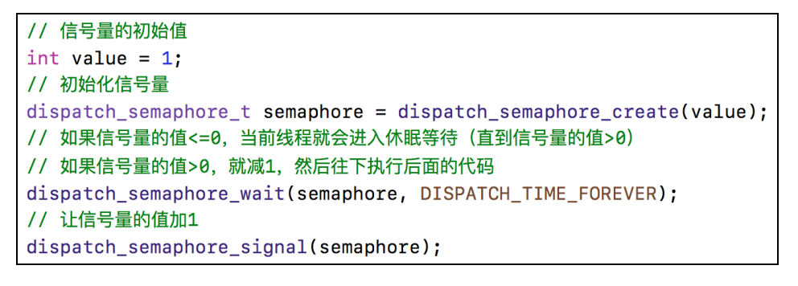

  + 控制线程并发访问的最大数量测试

    ```objc
    #import "SemaphoreDemo.h"
    
    @interface SemaphoreDemo()
    @property (strong, nonatomic) dispatch_semaphore_t semaphore;
    @end
    
    @implementation SemaphoreDemo
    
    - (instancetype)init
    {
        if (self = [super init]) {
            self.semaphore = dispatch_semaphore_create(5);
        }
        return self;
    }
    
    - (void)test
    {
        // 如果信号量的值 > 0，就让信号量的值减1，然后继续往下执行代码
        // 如果信号量的值 <= 0，就会休眠等待，直到信号量的值变成>0，就让信号量的值减1，然后继续往下执行代码
        dispatch_semaphore_wait(self.semaphore, DISPATCH_TIME_FOREVER);
        NSLog(@"test - %@", [NSThread currentThread]);
        sleep(2);
        // 让信号量的值+1
        dispatch_semaphore_signal(self.semaphore);
    }
    
    @end
      
    //调用: 每次并发执行5个线程
    @implementation ViewController
    - (void)viewDidLoad {
        [super viewDidLoad];
        MJBaseDemo *demo = [[SemaphoreDemo alloc] init];
        dispatch_queue_t queue = dispatch_get_global_queue(0, 0);
        for (int i = 0; i < 100; i++) {
            dispatch_async(queue, ^{
                [demo performSelector:@selector(test) withObject:nil ];
            });
        }
    }
    @end
    ```

  + 线程同步测试

    ```objc
    #import "SemaphoreDemo.h"
    @interface SemaphoreDemo()
    @property (strong, nonatomic) dispatch_semaphore_t ticketSemaphore;
    @property (strong, nonatomic) dispatch_semaphore_t moneySemaphore;
    @end
    
    @implementation SemaphoreDemo
    
    - (instancetype)init
    {
        if (self = [super init]) {
            self.ticketSemaphore = dispatch_semaphore_create(1);
            self.moneySemaphore = dispatch_semaphore_create(1);
        }
        return self;
    }
    
    - (void)__drawMoney
    {
        dispatch_semaphore_wait(self.moneySemaphore, DISPATCH_TIME_FOREVER);
        [super __drawMoney];
        dispatch_semaphore_signal(self.moneySemaphore);
    }
    
    - (void)__saveMoney
    {
        dispatch_semaphore_wait(self.moneySemaphore, DISPATCH_TIME_FOREVER);
        [super __saveMoney];
        dispatch_semaphore_signal(self.moneySemaphore);
    }
    
    - (void)__saleTicket
    {
        dispatch_semaphore_wait(self.ticketSemaphore, DISPATCH_TIME_FOREVER);
        [super __saleTicket];
        dispatch_semaphore_signal(self.ticketSemaphore);
    }
    
    @end
    
    ```

    ```objc
    利用宏定义简化代码
      
    #define SemaphoreBegin \
    static dispatch_semaphore_t semaphore; \
    static dispatch_once_t onceToken; \
    dispatch_once(&onceToken, ^{ \
        semaphore = dispatch_semaphore_create(1); \
    }); \
    dispatch_semaphore_wait(semaphore, DISPATCH_TIME_FOREVER);
    
    #define SemaphoreEnd \
    dispatch_semaphore_signal(semaphore); dispatch_semaphore_wait(semaphore, DISPATCH_TIME_FOREVER);
    
    - (void)test
    {
      SemaphoreBegin
      //访问资源
      SemaphoreEnd
    }
    ```

### @synchronized

+ @synchronized是对mutex递归锁的封装

+ 源码查看：objc4中的objc-sync.mm文件

  ```
   objc_sync_enter
   objc_sync_exit
   
  //其内部是一个hashMap-> StripedMap
  //obj作为key
  //SyncData作为value
  //SyncData其内部包含了一个递归锁,使用这个递归锁进行加锁解锁
  ```

+ 其内部是一个hash表，以对象作为key，找到对应的锁，进行加锁解锁操作

+ @synchronized(obj)内部会生成obj对应的递归锁，然后进行加锁、解锁操作

  

+ 测试代码

  ```objc
  @implementation SynchronizedDemo
  - (void)__drawMoney
  {
      @synchronized([self class]) {
          [super __drawMoney];
      }
  }
  - (void)__saveMoney
  {
      @synchronized([self class]) { // objc_sync_enter
          [super __saveMoney];
      } // objc_sync_exit
  }
  - (void)__saleTicket
  {
      static NSObject *lock;
      static dispatch_once_t onceToken;
      dispatch_once(&onceToken, ^{
          lock = [[NSObject alloc] init];
      });
      
      @synchronized(lock) {
          [super __saleTicket];
      }
  }
  
  - (void)otherTest
  {
      @synchronized([self class]) {
          [self otherTest];
      }
  }
  @end
  
  ```

+ 分析源码

  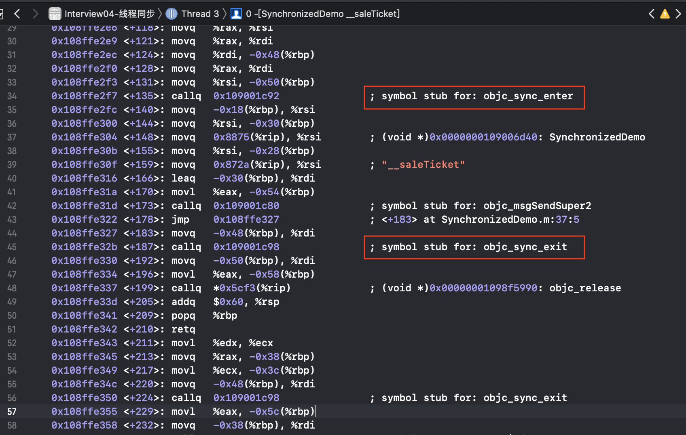

  ```objc
  int objc_sync_enter(id obj)
  {
      int result = OBJC_SYNC_SUCCESS;
  
      if (obj) {
          SyncData* data = id2data(obj, ACQUIRE);
          assert(data);
          data->mutex.lock();
      } else {
          // @synchronized(nil) does nothing
          if (DebugNilSync) {
              _objc_inform("NIL SYNC DEBUG: @synchronized(nil); set a breakpoint on objc_sync_nil to debug");
          }
          objc_sync_nil();
      }
  
      return result;
  }
  ```

  ```objc
  static SyncData* id2data(id object, enum usage why)
  {
      spinlock_t *lockp = &LOCK_FOR_OBJ(object);
      SyncData **listp = &LIST_FOR_OBJ(object);
      SyncData* result = NULL;
      ......
      .....
      return result;
  }
  
  #define LOCK_FOR_OBJ(obj) sDataLists[obj].lock
  #define LIST_FOR_OBJ(obj) sDataLists[obj].data
  static StripedMap<SyncList> sDataLists; 
  typedef struct SyncData {
      struct SyncData* nextData;
      DisguisedPtr<objc_object> object;
      int32_t threadCount;  // number of THREADS using this block
      recursive_mutex_t mutex; 
  } SyncData;
  ```

### 同步方案性能对比

+ 性能从高到低排序

  - os_unfair_lock
  - OSSpinLock
  - dispatch_semaphore:推荐使用
  - pthread_mutex(normal):推荐使用
  - dispatch_queue(DISPATCH_QUEUE_SERIAL)
  - NSLock
  - NSCondition
  - pthread_mutex(recursive)
  - NSRecursiveLock
  - NSConditionLock
  - @synchronized

  ```
  1. os_unfair_lock是OSSpinLock的替换要到ios10以后才能使用，
  2. OSSpinLock存在优先级反转的问题
  3. dispatch_semaphore推荐使用,性能比较高，而且ios8之后就可用
  4. pthread_mutex普通锁推荐使用，跨平台，效率也可以
  5. dispatch_queue效率稍低
  6. NSLock是mutex普通锁的封装
  7. NSCondition是对mutex条件锁的封装，内部更复杂
  8. pthread_mutex递归锁,实现更复杂
  9. NSRecursiveLock是pthread_mutex递归锁的封装，所以更弱
  10. NSConditionLock是对NSCondition的进一步封装
  
  锁性能对比的文章??
  ```

### 自旋锁、互斥锁对比

+ 什么情况使用自旋锁比较划算？

  - 预计线程等待锁的时间很短

    ```
    自旋锁因为一直在while循环，所以如果等待时间较长的时候，多条线程会更多的占用cpu资源
    ```

  - 加锁的代码（临界区）经常被调用，但竞争情况很少发生

    ```
    竞争情况很少:指的是多条线程同时访问同一块资源的情况比较少
    临界区: lock和unlock之间的代码
    
    自旋锁因为一直在while循环，所以能更快的响应
    ```

  - CPU资源不紧张

    ```
    自旋锁会占用cpu资源
    ```

  - 多核处理器

    ```
    CPU资源相对不紧张
    ```

    

+ 什么情况使用互斥锁比较划算？

  - 预计线程等待锁的时间较长

    ```
    此时互斥锁可以让线程睡觉，不占用cpu资源
    ```

  - 单核处理器

    ```
    cpu能力较低时，尽量不占用cpu资源
    ```

  - 临界区有IO操作

    ```
    临界区有io操作时，会占用cpu资源。所以最好不要用自旋锁，因为自旋锁会占用cpu资源，
    也就是正在执行的线程去进行文件读写操作时，需要大量cpu资源。那么此时其他线程最好去睡觉
    不要占用cpu资源
    ```

  - 临界区代码复杂或者循环量大

    ```
    比较耗cpu资源，所以不要让其他线程占用cpu
    ```

  - 临界区竞争非常激烈

    ```
    比较耗cpu资源，所以不要让其他线程占用cpu
    ```

+ 资源竞争是锁存在的意义，所以竞争情况理论上是一定会发生的。那么我们可以根据实际情况中，资源竞争发生的多还是少，来决定选用哪种锁
+ 自旋锁的特点是一直尝试获取锁，线程会占用一定的cpu资源
+ 互斥锁的特点是获取不到锁，将让当前线程休眠，不占用cpu资源
+ 除了OSSpinLock是自旋锁之外，其他的锁都是互斥锁。

### atomic 

+ atomic用于保证属性setter、getter的原子性操作，相当于在getter和setter内部加了线程同步的锁

  ```
  最好不要使用atomic，因为除了多线程访问外，我们正常使用时太消耗性能。
  如果要加锁，直接使用前面的加锁方法，在使用属性前后加锁就好了
  ```

+ 可以参考源码objc4的objc-accessors.mm

+ 它并不能保证使用属性的过程是线程安全的

  ```objc
  MJPerson *p = [[MJPerson alloc] init];
  NSMutableArray *array = p.data;
  [array addObject:@"1"];
  [array removeObject:@"1"];
  [array addObject:@"3"];
  
  //多线程操作的时候array本身并不是线程安全的,在操作array进行加锁，解锁来保证线程安全
  
  MJPerson *p = [[MJPerson alloc] init];
  NSMutableArray *array = p.data;
  //加锁
  [array addObject:@"1"];
  [array removeObject:@"1"];
  [array addObject:@"3"];
  //解锁
  ```

+ 源码分析

  ```objc
  //getter
  id objc_getProperty(id self, SEL _cmd, ptrdiff_t offset, BOOL atomic) {
      if (offset == 0) {
          return object_getClass(self);
      }
  
      //nonatomic
      id *slot = (id*) ((char*)self + offset);
      if (!atomic) return *slot;
          
      //atomic：加锁，解锁
      spinlock_t& slotlock = PropertyLocks[slot];
      slotlock.lock();
      id value = objc_retain(*slot);
      slotlock.unlock();
      
      // for performance, we (safely) issue the autorelease OUTSIDE of the spinlock.
      return objc_autoreleaseReturnValue(value);
  }
  
  //setter
  void objc_setProperty_atomic(id self, SEL _cmd, id newValue, ptrdiff_t offset)
  {
      reallySetProperty(self, _cmd, newValue, offset, true, false, false);
  }
  
  
  static inline void reallySetProperty(id self, SEL _cmd, id newValue, ptrdiff_t offset, bool atomic, bool copy, bool mutableCopy)
  {
      if (offset == 0) {
          object_setClass(self, newValue);
          return;
      }
  
      id oldValue;
      id *slot = (id*) ((char*)self + offset);
  
      if (copy) {
          newValue = [newValue copyWithZone:nil];
      } else if (mutableCopy) {
          newValue = [newValue mutableCopyWithZone:nil];
      } else {
          if (*slot == newValue) return;
          newValue = objc_retain(newValue);
      }
      if (!atomic) {//nonatomic
          oldValue = *slot;
          *slot = newValue;
      } else {
          //atomic：加锁，解锁
          spinlock_t& slotlock = PropertyLocks[slot];
          slotlock.lock();
          oldValue = *slot;
          *slot = newValue;        
          slotlock.unlock();
      }
      objc_release(oldValue);
  }
  
  ```

### 读写安全

+ 思考如何实现以下场景?
  - 同一时间，只能有1个线程进行写的操作
  
  - 同一时间，允许有多个线程进行读的操作
  
    ```
    提高读的效率
    ```
  
  - 同一时间，不允许既有写的操作，又有读的操作
+ 上面的场景就是典型的“多读单写”，经常用于文件等数据的读写操作，iOS中的实现方案有
  - pthread_rwlock：读写锁
  - dispatch_barrier_async：异步栅栏调用

### pthread_rwlock

+ 等待锁的线程会进入休眠

  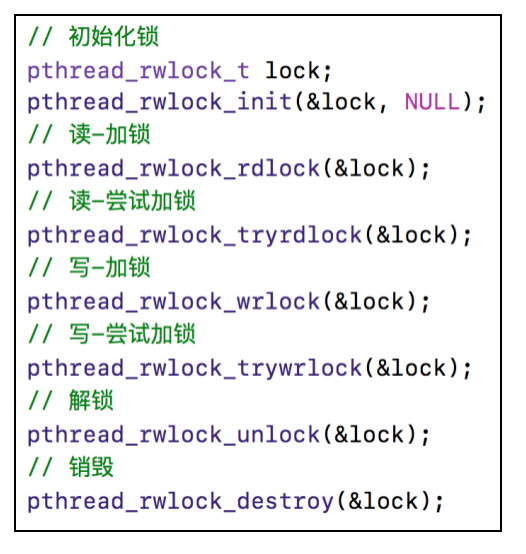

+ pthread_rwlock_rdlock: 加读锁, 读锁可以被多条线程同时获取锁，写线程被阻塞。

+ pthread_rwlock_wrlock: 加写锁, 只能有一条线程获取写锁，且其他线程都被阻塞。

+ 代码测试

  ```objc
  #import "ViewController.h"
  #import <pthread.h>
  @interface ViewController ()
  @property (assign, nonatomic) pthread_rwlock_t lock;
  @end
  
  @implementation ViewController
  
  - (void)viewDidLoad {
      [super viewDidLoad];
      
      // 初始化锁
      pthread_rwlock_init(&_lock, NULL);
      
      dispatch_queue_t queue = dispatch_get_global_queue(0, 0);
      
      for (int i = 0; i < 10; i++) {
          dispatch_async(queue, ^{
              [self read];
          });
          
          dispatch_async(queue, ^{
              [self read];
          });
          dispatch_async(queue, ^{
              [self read];
          });
          dispatch_async(queue, ^{
              [self write];
          });
      }
  }
  
  
  - (void)read {
      //加读锁:读锁可以被多条线程同时获取锁
      pthread_rwlock_rdlock(&_lock);
      
      NSLog(@"%s", __func__);
      sleep(1);
      
      pthread_rwlock_unlock(&_lock);
  }
  
  - (void)write
  {
      //加写锁
      pthread_rwlock_wrlock(&_lock);
      
      NSLog(@"%s", __func__);
      sleep(1);
      
      pthread_rwlock_unlock(&_lock);
  }
  - (void)dealloc
  {
      pthread_rwlock_destroy(&_lock);
  }
  
  @end
  
  //从打印结果来看，多条read线程同时打印，而write线程同时只有一条线程打印
  ```

### dispatch_barrier_async

+ 这个函数传入的并发队列必须是自己通过dispatch_queue_cretate创建的

+ 如果传入的是一个串行或是一个全局的并发队列，那这个函数便等同于dispatch_async函数的效果

  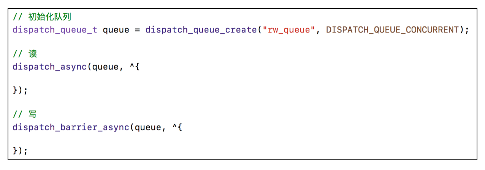

+ 代码测试

  ```objc
  #import "ViewController.h"
  #import <pthread.h>
  
  @interface ViewController ()
  @property (strong, nonatomic) dispatch_queue_t queue;
  @end
  
  @implementation ViewController
  
  - (void)viewDidLoad {
      [super viewDidLoad];
      
  //    NSOperationQueue *queue = [[NSOperationQueue alloc] init];
  //    queue.maxConcurrentOperationCount = 5;
      
  //    dispatch_semaphore_create(5);
      
      self.queue = dispatch_queue_create("rw_queue", DISPATCH_QUEUE_CONCURRENT);
      
      for (int i = 0; i < 10; i++) {
          dispatch_async(self.queue, ^{
              [self read];
          });
          
          dispatch_async(self.queue, ^{
              [self read];
          });
          dispatch_async(self.queue, ^{
              [self read];
          });
          dispatch_barrier_async(self.queue, ^{
              [self write];
          });
      }
  }
  - (void)read {
      NSLog(@"read");
      sleep(1);
  }
  
  - (void)write
  {
      NSLog(@"write");
      sleep(1);
  }
  
  @end
  //从打印结果来看，多条read线程同时打印，而write线程同时只有一条线程打印
  ```

​       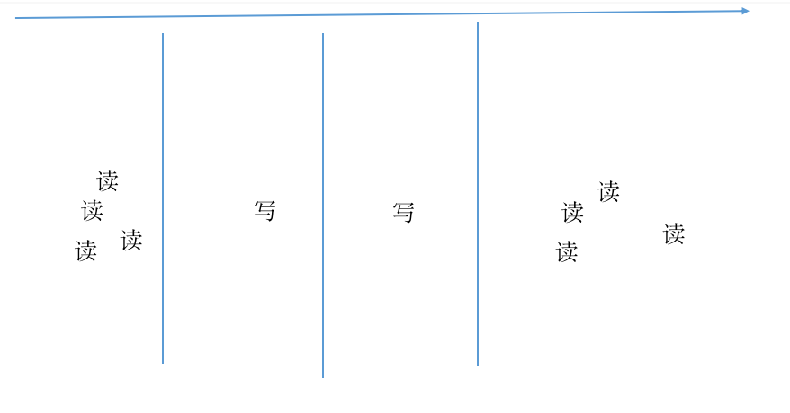

### 面试题

+ 请问下面代码的打印结果是什么？

  

  ```
  打印结果是：1、3
  
  原因:
  performSelector:withObject:afterDelay:的本质是往Runloop中添加定时器
  子线程默认没有启动Runloop
  ```

  ```objc
  解决方案:
  
   dispatch_queue_t queue = dispatch_get_global_queue(0, 0);
      
      dispatch_async(queue, ^{
          NSLog(@"1");
          // 这句代码的本质是往Runloop中添加定时器
          [self performSelector:@selector(test) withObject:nil afterDelay:.0];
          NSLog(@"3");
          //启动runloop，执行完定时器，runloop停止,然后执行后面的打印
          [[NSRunLoop currentRunLoop] runMode:NSDefaultRunLoopMode beforeDate:[NSDate distantFuture]];
           NSLog(@"4");
   });
  
  打印结果是：1、3、2、4 
  ```


+ 你理解的多线程？
+ iOS的多线程方案有哪几种？你更倾向于哪一种？
+ 你在项目中用过 GCD 吗？
+ GCD 的队列类型
+ 说一下 OperationQueue 和 GCD 的区别，以及各自的优势
+ 线程安全的处理手段有哪些？
+ OC你了解的锁有哪些？在你回答基础上进行二次提问；
  - 追问一：自旋和互斥对比？
  - 追问二：使用以上锁需要注意哪些？
  - 追问三：用C/OC/C++，任选其一，实现自旋或互斥？口述即可！


